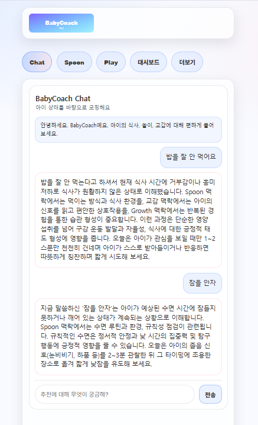
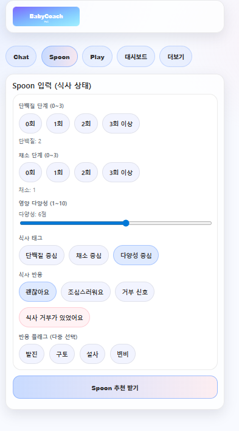
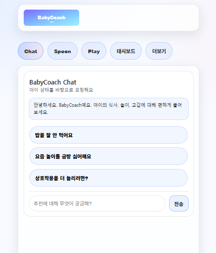

# BabyCoach PoC (LangGraph + FastAPI)

## 프로젝트 개요
-  아기의 이유식(영양)·놀이·상호작용 환경이 발달에 미치는 영향을 후성유전학적 관점에서 해석하고,
- 환경과 발달의 연결을 기반으로 부모가 더 나은 육아 환경을 설계하고 실천하도록 넛지하는 후성유전학 기반 멀티모달 육아 코칭 에이전트 PoC 개발을 목적으로 함
- 구체적 BabyCoach PoC는 부모가 아기 상태를 빠르게 체크하면, LangGraph 오케스트레이션 흐름을 통해 `Nutrition / Play / Interaction / Epigenetic / Growth / Ranker / Nudge / Explanation` 단계의 추천을 생성합니다.  
- 추가로 단일 `BabyCoach` 챗봇 인터페이스가 추천 결과를 바탕으로 `/chat`에서 대화 응답을 제공합니다.

#### 후성유전학이 보는 초기 양육
- 후성유전학은 DNA 염기서열을 바꾸지 않고, DNA 메틸화·히스톤 수식·miRNA 등으로 유전자 발현을 “켜고 끄는” 분자 메커니즘으로
- 디지털테라퓨틱스(DTx) 분야에서는 이론적 배경으로 자리잡고 있음.
- 특히 임신기와 영유아기(생애 초기 수년)는 이런 후성유전적 변화에 가장 민감한 시기이기 때문에, 
- 이때의 환경이 평생의 뇌 기능·행동·질병 취약성을 프로그래밍한다는 관점이 정설임.
- 그러나 기존 Rule base 기반의 영유아 코칭 프로그램에서는 이를 담을 수 없는 한계를 Agentic AI를 도입하여 극복하고자 PoC를 실험함

#### 1차 구현된 모습




## 가장 먼저 확인 (키 없이 실행)
이 PoC는 `.env`에 `OPENAI_API_KEY`가 없어도 최소 동작을 확인할 수 있도록 기본이 `BABYCOACH_LLM_MOCK=1` 모드로 동작합니다.  
아무 설정 없이도 아래대로 진행하면 `/health`와 `/recommend`의 응답 포맷을 확인할 수 있어요.

## 폴더 구조
권장 구조(요청사항 반영):
```text
babycoach_proj/
├─ app/
│  ├─ __init__.py
│  ├─ main.py
│  ├─ config.py
│  ├─ state.py
│  ├─ graph.py
│  ├─ formatter.py
│  ├─ llm.py
│  ├─ schemas.py
│  ├─ agents/
│  │  ├─ __init__.py
│  │  ├─ nutrition_agent.py
│  │  ├─ play_agent.py
│  │  ├─ interaction_agent.py
│  │  ├─ epigenetic_agent.py
│  │  ├─ growth_agent.py
│  │  ├─ ranker_agent.py
│  │  ├─ nudge_agent.py
│  │  └─ explanation_agent.py
│  ├─ api/
│  │  ├─ __init__.py
│  │  ├─ recommend.py
│  │  └─ chat.py
│  └─ ui/
│     ├─ __init__.py
│     └─ app_ui.py
├─ data/
│  ├─ sample_input_1.json
│  └─ sample_input_2.json
├─ notebooks/
│  └─ babycoach_poc.ipynb
├─ tests/
│  └─ test_smoke.py
├─ .env.example
├─ requirements.txt
└─ README.md
```

## 가상환경 실행 방법
Windows 기준:
```powershell
cd D:\PyProject\AIFFEL_AI\LLM\NLP\babycoach_proj
python -m venv .venv
.venv\Scripts\Activate.ps1
```

## 패키지 설치 방법
```powershell
pip install -r requirements.txt
```

## `.env` 설정 방법
1. 프로젝트 루트에 `.env` 파일 생성
2. 최소 `OPENAI_API_KEY`를 설정

예:
```dotenv
OPENAI_API_KEY=sk-...
BABYCOACH_LLM_MOCK=0
```

키가 없으면 런타임에서 명확한 에러를 출력합니다.  
단, 기본값은 키가 없으면 자동으로 mock 모드가 켜집니다.  
실제 GPT 응답을 원하면 `BABYCOACH_LLM_MOCK=0`로 두세요.

## FastAPI 실행 방법
```powershell
python -m uvicorn app.main:app --reload
```

브라우저 UI는 `http://127.0.0.1:8000/` 에서 확인할 수 있습니다.

## /recommend 테스트 예시
샘플 입력 파일:
`data/sample_input_1.json`

cURL 예:
```bash
curl -X POST http://127.0.0.1:8000/recommend ^
  -H "Content-Type: application/json" ^
  --data "@data/sample_input_1.json"
```

## /chat 테스트 예시
`/recommend` 응답(`final_output`)을 그대로 `/chat`의 `final_output`에 넣고 테스트합니다.
요청 예시는 아래 섹션을 참고하세요.

## 샘플 입력 파일 설명
- `data/sample_input_1.json`: 알레르기 칩 일부 포함, 식사/놀이/상호작용 상태가 중간 값인 케이스
- `data/sample_input_2.json`: 다른 반응 플래그 조합, 놀이 유형 다양성이 더 높은 케이스

## API 명세
### /recommend
#### request 예시
```json
{
  "age_months": 10,
  "weight_kg": 8.7,
  "allergies": ["우유"],
  "notes": "새로운 음식 조심스럽게 도입 중",
  "protein_count_3d": 2,
  "vegetable_count_3d": 1,
  "food_diversity_3d": 6,
  "meal_refusal": false,
  "reaction_flags": ["발진"],
  "play_types": ["촉감 놀이", "쌓기 놀이"],
  "focus_minutes": 7,
  "repeat_count": 3,
  "child_led_ratio": 0.4,
  "refusal": false,
  "parent_note": "손으로 만지고 흔드는 걸 좋아함",
  "touch_count": 3,
  "labeling_count": 2,
  "joint_attention_count": 4,
  "responsive_turns": 2,
  "flat_response": false,
  "parent_query": "단백질 식재료는 어떤 걸 말하는 거야?"
}
```

#### response 예시
```json
{
  "final_output": {
    "spoon": {
      "title": "Spoon",
      "suggestions": ["단백질: 부드러운 달걀 흰자/두부..."],
      "notes": "..."
    },
    "play": {
      "title": "Play",
      "suggestions": ["촉감 놀이로 감각 자극을..."],
      "notes": "..."
    },
    "growth": {
      "title": "Growth",
      "observation_points": ["손-입 반응을 관찰해보세요.", "..."]
    },
    "nudge": {
      "title": "오늘의 한 문장 코칭",
      "nudge_message": "오늘은 단백질 텍스처를 한 숟갈만 천천히 해요.",
      "tags": ["영양", "놀이"]
    },
    "explanation": {
      "title": "설명",
      "explanation": "지금은 식사/놀이 신호를 바탕으로 편안한 흐름을 우선해요. 왜 중요한지: 짧게 시작하면 반복이 쉬워져요. 오늘 제안: 한 가지 행동만 바로 해보세요."
    },
    "chat_context_summary": "요약..."
  }
}
```

### /chat
#### request 예시
```json
{
  "final_output": {
    "spoon": { "title": "Spoon", "suggestions": ["..."], "notes": "..." },
    "play": { "title": "Play", "suggestions": ["..."], "notes": "..." },
    "growth": { "title": "Growth", "observation_points": ["..."] },
    "nudge": { "title": "오늘의 한 문장 코칭", "nudge_message": "오늘은 단백질 텍스처를 한 숟갈만 천천히 해요.", "tags": ["..."] },
    "explanation": { "title": "설명", "explanation": "지금 놀이는 집중 7분, 반복 3회, 아이 주도 비율 0.40예요. 왜 중요한지: 짧게 반복하면 성공 경험이 쌓여요. 오늘 제안: 한 가지 행동만 바로 해보세요." },
    "chat_context_summary": "요약..."
  },
  "state_summary": "요약(선택)",
  "user_message": "왜 이런 놀이를 추천했어?"
}
```

#### response 예시
```json
{
  "assistant_message": "오늘 결과를 바탕으로..."
}
```

## 확인/테스트
```powershell
pytest -q
```

